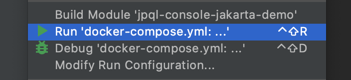
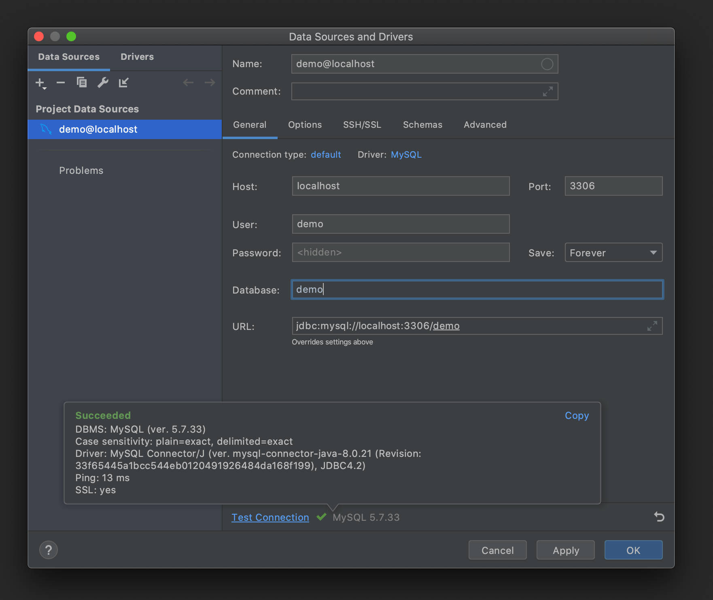
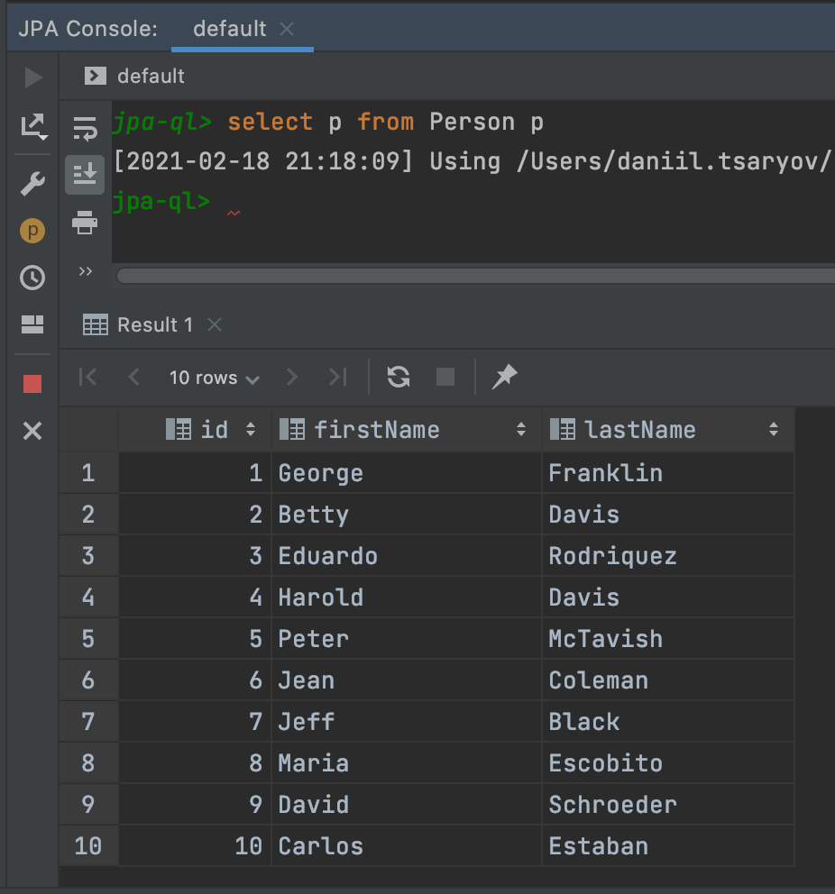

# IJ IDEA JPA Console - Jakarta Demo

## Setup

1. Deploy a container with provided `docker-compose.yml`:
   

2. Add MySQL datasource via `Database` tool window:
   

3. Init DB with SQL scripts from `src/main/resources/db/`:
   
    3.1 `user.sql`
   
    3.2 `schema.sql`

    3.3 `data.sql`
   
Db creds are: `demo` / `demo` 

## Testing

1. Open `Persistence` tool window
2. Open JPA console
3. Invoke the query in console: `select p from Person p`:

